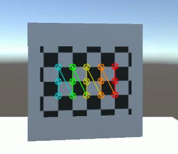

# Camera Calibration

## Introduction
This project is to calibrate a camera using a set of chessboard images. The calibration process is done in two steps:

1. **Camera Calibration**: This step is to find the camera matrix and distortion coefficients. The camera matrix is used to project 3D points to 2D image points. The distortion coefficients are used to correct the distortion in the image.

2. **Get Camera rotation matrix**: This step is to find the rotation matrix of the camera. The rotation matrix is used to rotate the camera to the world coordinate system.

## Tools

### Convert JPG to MP4
To convert a series of JPG images into an MP4 video, follow these steps:

1. Navigate to the `jpgtomp4` folder.
2. Place the folder containing your JPG images inside the `jpgtomp4` directory.
3. In the `jpgtomp4` folder, run the following command to generate the MP4 video:
```
# example
python main.py --input_folder camera_1 --output_video chessboard_1.mp4 --frame_rate 30
```

### Convert MP4 with Chessboard to Camera Matrix and Distortion Coefficients
This guide explains how to convert a video containing a chessboard pattern into camera calibration parameters such as the camera matrix and distortion coefficients.

1. Navigate to the `chessboard_detection` folder.

2. Place Your MP4 File:
    * Move your MP4 file containing the chessboard video to the following folder:
    ```
    chessboard_detection/camera_calibration_data/camera_X
    ```
    * Rename the file appropriately, for example:
    ```
    chessboard_detection/camera_calibration_data/camera_1/chessboard.mp4
    ```

2. Run the Calibration Script: Use the following command to run the camera calibration. You need to provide the following parameters:

    * `-l` : The length of each square on the checkerboard (in meters).
    * `-r` : The number of rows of squares in the checkerboard.
    * `-c` : The number of columns of squares in the checkerboard.
    * `-f` : The folder containing the images or videos (e.g., "camera_1").

    Example:
    ```
    python chessboard_detection.py -l 1.25 -r 3 -c 5 -f camera_1
    ```

    In this example:

    
    * The square length is set to 1.25 meters.
    * The checkerboard has 3 rows and 5 columns.
